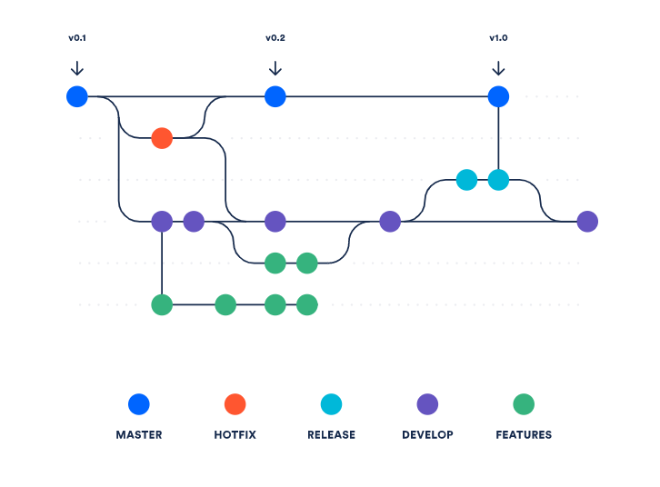

## Documentazione dell'architettura del progetto

### Introduzione
In questa documentazione, verrà descritta l'architettura del progetto: l'obiettivo è fornire una panoramica generale della struttura del sistema e dei suoi componenti principali; un particolare focus verrà dato alle motivazioni per le quali il progetto è stato strutturato in questa maniera.

Nell'analisi dell'architettura particolare attenzione alla soddisfazione dei seguenti requisiti:

- utilizzo di un approccio *cloud ready* per una più veloce prototipazione del progetto e una più ampia flessibilità e scalabilità sull'infrastrttura di produzione: lo sviluppato attuato tramite *containerizzazione* ha garantito una modalità di approccio universale per tutti i membri de team, unificando l'esperienza di sviluppo e garantendo l'uniformità dei risultati ottenuti;

- versionamento del codice tramite *Git* per permettere sin dalle prime fasi di mantenere il codice sorgente pulito, garantire durante il progetto una migliore possibilità di collaborazione asincrona all'interno del *team* dislocato in maniera remota, dare la possibilità di eseguire *refactoring* del codice senza il rischio di perdere funzionalità;

- possibilità di poter automatizzare il flusso operativo, mantenendo quindi aperta la possibilità di rendere indipendenti i flussi di estrazione, trasformazione e caricamento del dato oltre che ulteriori sistemi di *data quality* che possono essere integrati;

- no *vendor lock-in*: per garantire la possibilità ad ogni membro del *team* di utilizzare sistemi operativi differenti (*Windows*, *MacOS*, *Linux*) e all'ambiente di produzione di poter essere efficientato nel miglior compromesso richiesto tra prestazioni, *know-how interno* e costi.

- realizzazione di una *data platform* modulare e che dia la possibilità di poter sviluppare ulteriormente nuovi requisiti.

Per quanto alcuni di questi requisiti possano sembrare di natura tecnica e a tratti astratti o banali, si è ritenuto corretto esplicitarli in quanto sono frutto di un comune accordo a seguito dell'analisi preliminare del progetto; inoltre, si è ritenuto che la loro esposizione possa essere utile per comprendere le scelte progettuali effettuate e le motivazioni che le hanno guidate.

### Visione: il concetto di *data platform*

Il progetto RBS-HARPA è stato sviluppato con l'obiettivo di realizzare una *data platform* che permetta di integrare, elaborare e analizzare i dati forniti da HARPA, al fine di fornire previsioni accurate sui consumi energetici futuri.

La *data platform* è stata progettata per essere modulare e flessibile, in modo da poter essere facilmente estesa e adattata a nuovi requisiti; questo aspetto di apertura è stato ritenuto importante fin dall'inizio, con l'intenzione di poter integrare nuove funzionalità e nuovi dati in futuro.

Il concetto è vicino a quello di *data warehouse*, ma con una visione più moderna e flessibile, come un *data lake*: dalla commistione dei due la *data platform* è stata progettata per essere in grado di integrare dati provenienti da diverse fonti, di diversa natura e di diversa granularità in maniera più rapida rispetto a una piattaforma tradizionale.

L'idea non è innovativa, ma è stato scelta in quanto ha permesso di realizzare una veloce prototipazione facilitando e promuovendo l'analisi esplorativa dei dati, la realizzazione di modelli di previsione e l'analisi dei risultati ottenuti. 

### Architettura a livelli
Il progetto segue un'architettura a livelli, che consente una separazione chiara delle responsabilità all'interno dell'infrastrttura stessa e una migliore manutenibilità del codice. 

Questa tipologia di sviluppo ha permesso di astrarre le complessità di ogni singolo livello, garantendo una maggiore chiarezza durante le fasi di sviluppo; inoltre a differenza di un sistema monolitico nel quale ogni modifica richiede un *rollback* completo, in un'architettura a livelli è possibile effettuare modifiche in maniera più granulare, ottimizzando le tempistiche di manutenzione.

Dominante in questo progetto è la separazione tra i dati e il modello di previsione: i dati vengono estratti, trasformati e caricati in un database *PostgreSQL*, mentre il modello di previsione viene eseguito su questi dati, restituendo le previsioni sui consumi energetici futuri.

Rimane comunque possibile storicizzare le previsioni ottenute su *database*, così da poter alimentare un confronto tra le previsioni ottenute e i dati reali, garantendo una migliore comprensione del modello e la possibilità di effettuare *refactoring* del modello stesso: questo risulterebbe possibile sia attraverso un'analisi automatica dei dati, sia attraverso un'analisi manuale.

I livelli principali dell'architettura sono:

1. *Layer* estrazione del dato: HARPA si è impegnata nel fornire i dati attraverso 3 file *csv*; ulteriori dati sono stati estratti con integrazioni sviluppate in *Python* come ad esempio i dati meteoreologici sfruttanto *API* dedicate;  

2. *Layer* trasformazione e pulizia del dato: tramite *Python* i dati vengono puliti e normalizzati, risolte eventuali anomalie, gestite casistiche che hanno richiesto un'analisi di qualità del dato più approfondita;

3. *Layer* caricamento del dato: con *Python* i dati vengono infine caricati su un database *Postgresql*, nel quale vengono popolate differenti tabelle in base alla granularità dell'aggregazione: per favorire l'analisi e il test di differenti modelli soprattutto nelle prime fasi di analisi esplorativa sono state create le seguenti tabelle:

4. *Layer* esecuzione del modello di previsione: attingendo dal database *Postgresql* il modello sviluppato in Pyton permette di eseguire le elaborazioni necessarie per restituire in *output* le previsioni sui consumi energetici nel periodo richiesto. Il modello prevede una fase di *training* e *test* sui dati storicizzati precedente all'applicazione del modello sui dati previsionali utilizzati come *features*.

I livelli sopra descritti vengono eseguiti tramite un'architettura basata su micro-servizi (*Container*) utilizzando immagini e prodotti *open-source*, ma di comune adozione: difatti le tecnologie possono essere ricondotte a *Python* e *Postgresql*, i quali provisionati tramite containerizzazione o sistemi *cloud ready* sono facilmente replicabili e costo efficienti.

Il tempo medio di esecuzione del modello, comprensivo di avviamento dei container, su un'architettura di fascia bassa con requisiti minimi, definibile da un processore *Intel i3* di sesta generazione, 16 GB di *ram* e SSD rimane nell'intorno inferiore ai 5 minuti; ipotizzando che i dati possano essere caricati in maniera quotidiana risulta quindi che già con i requisiti *hardware* minimi è possibile avere previsioni aggiornate. 

L'utilizzo di *PostgreSQL* permette al team di poter lavorare in maniera continua sul progetto, ottimizzando le tempistiche di caricamento dei dati, soprattutto in ottica dell'ambiente di produzione dove possono essere caricate differenti procedure in base alle richieste (consumo quotidiano del modello previsionale o eventuali manutenzioni evolutive).

Come si può notare dal diagramma sopra riportato, il contenuto del progetto sia per quanto riguarda il codice sorgente, i dati e il modello dell'architettura è sottoposto a versionamento tramite *Git* e *GitHub*; il modello di sistema *software defined* permette di poter replicare l'ambiente di sviluppo in maniera identica su qualsiasi macchina, garantendo un'esperienza di sviluppo uniforme.

I linguaggi di *scripting* utilizzati sono stati *Python* (versione 3.11) e *PL/SQL*; il primo è stato scelto per la sua flessibilità e la sua vasta adozione nel campo del *data science* comprendente molte librerie ben documentate, mentre il secondo è stato scelto per la sua capacità di gestire grandi aggregazioni di dati; mentre il primo è stato utilizzato per la pulizia dei dati e la realizzazione del modello di previsione, il secondo è stato utilizzato per la creazione del database e la gestione di una quantità di dati in crescita costante.

Nel merito dell'ambiente di sviluppo si è lasciata libertà nell'utilizzo degli strumenti, chiarendo i requisiti minimi necessari e consigliando caldamente l'utilizzo di *Anaconda* come ambiente di sviluppo per *Python*, eseguendo una personalizzazione ad hoc per il progetto; in alternativa è stato proposto di utilizzare *Venv* per la gestione degli ambienti *Python* e relative librerie.

Infine si può convenire che le scelte effettuate per la realizzazione di questa architettura siano state fatte per raggiungere il miglior risultato tra prestazioni, affidabilità, sicurezza, esperienza e conosceza necessarie per la realizzazione e la manutenzione del progetto. I concetti che sono stati esposti hanno permesso al *team* di comprendere più a fondo caratteristiche e limiti dei sistemi adottati, mitigando i rischi di ritardo o di mancato raggiungimento degli *standard* di qualità richiesti.

### Approfondimento sulla containerizzazione

La containerizzazione è stata scelta come soluzione per garantire un ambiente di sviluppo uniforme e replicabile, in modo da garantire che tutti i membri del team lavorino su un ambiente identico e che le soluzioni sviluppate siano facilmente trasferibili in un ambiente di produzione.

Il requisito dell'uniformità e della facilità di replicazione dell'ambiente dis viluppo è stata dettata dalla necessità di facilitare la collaborazione del *team* tramite lavoro remoto. La containerizzazione ha permesso di garantire che tutti i membri del team lavorino su le medsime librerie nella medesima versione, indipendentemente dal sistema operativo utilizzato. Inoltre permette di garantire un'ottima scalabilità del sistema, in quanto è possibile replicare i container su più macchine fisiche o virtuali, garantendo una maggiore affidabilità e tolleranza ai guasti.

_Credit Docker.com_

La containerizzazione è stata realizzata tramite *Docker* / *Podman*, software open-source che permettono di creare, testare e distribuire applicazioni all'interno di container. Questo ha permesso di creare container leggeri e portabili per qualsiasi applicazione, con tutto il necessario per farla funzionare, garantendo che il software funzioni sempre allo stesso modo, indipendentemente dall'ambiente in cui viene eseguito.

Sfruttando la possibilità di creare dei *pool* di container tramite un file *docker-compose.yml* gli *script* in *Python* e il *database PostgreSQL*  sono stati eseguiti in maniera indipendente, ma all'interno dello stesso contenitore, esponendo verso la macchina *host* solo le porte necessarie e condividendo solo quanto necessario all'esecuzione.

In conclusione, attraverso la containerizzazione è stato possibile demandare qualsiasi complessità di configurazione e installazione del software a un unico file di configurazione; il medesimo approccio è attuabile anche in un ambiente di produzione basato su *cloud*.

### Approccio al versionamento del codice

Durante la fase di analisi iniziale che ha coinvolto il *team* nelle prime fasi di sviluppo sono state decise differenti caratteristiche per il versionamento del codice: ogni *milestone* raggiunta è stata versionata e rilasciata, garantendo così un'ottima tracciabilità del lavoro svolto e la possibilità di tornare a versioni precedenti in caso di necessità.

_Credit GitHub.com_

Come indicatore è stato proposto di non utilizzare nuovi *branch* per grandi modifiche, ma di effetture più *pull request* per ogni *feature* sviluppata, in modo da garantire una più facile revisione del codice e ridurre la possibilità di conflitti tra quanto già presente e quanto di nuovo sviluppato.

Su Github l'utilizzo delle *milestone* è stato abilitato per tracciare i progressi del progetto, mentre le *issue* sono state utilizzate per tracciare i singoli compiti da svolgere, garantendo una migliore organizzazione del lavoro e una maggiore chiarezza sulle priorità. Con questo metodo è stato possibile procedere in maniera ordinata e responsabile, cercando di comprendere e risolvere le problematiche che si sono presentate durante lo sviluppo.

### Sicurezza dell'architettura

L'architettura del progetto è stata progettata con un'attenzione particolare alla sicurezza dei dati.

I *file* forniti da HARPA sono stati trattati come dati di rilevanza aziendale, e quindi sono stati trattati come tali: lo scambio all'interno del *team* è sempre avvenuto con strumenti adeguati basati su servizi *cloud* e dotati di autenticazione a due fattori.

L'integrazione necessaria ad importare i dati dai CSV a *PostgreSQL* tramite *Python* viene realizzata tramite il binomio utente / password: per le soluzioni adottate in sviluppo e quindi temporanee con un compromesso più verso l'utilizzabilità e la velocità di esecuzione, mentre per l'ambiente di produzione verrebbero adottate misure più stringenti, non garantendo accesso amministratore al database, ma basandosi su una *policy zero trust* e *role based access control*.

Per quanto riguarda l'esecuzione, la manutenzione e la visualizzazione del modello di previsione, l'accesso è al momento garantito solo accendendo in locale sulla macchina che ospota l'infrastrttura del container.

Per mantenere sempre sotto controllo quanto viene caricato su *Github* sono stati attivivati moduli di controllo che verificano e segnalano sia eventuali vulnerabilità legate a librerie utilizzate e una possibile *remediation*, sia eventuali *secrets* come *password*, *token* che vengono caricati per errore.
La segnalazione viene notificata a chi ha caricato il *commit* e a chi ha effettuato la modifica, garantendo così una maggiore consapevolezza e responsabilità, permettendo una rapida risoluzione del problema.

Infine, nonostante non sia possibile classificare i dati contentuti, il modello di previsione e le previsioni stesse come dati estremanente sensibili, è stato comunque adottato un approccio di sicurezza *by design* per gran parte delle scelte progettuali, affinchè in futuro questo aspetto possa concorrere a una *data platform* che sia *compliant* con le future normative vigenti.

