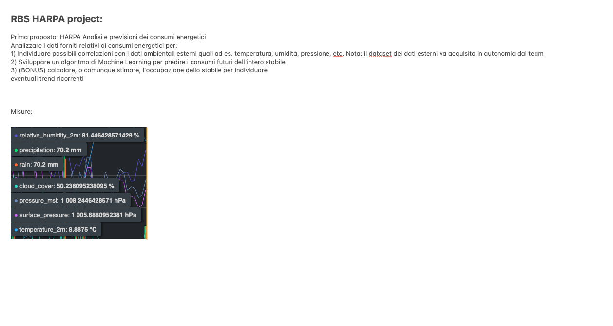

# RBS-HARPA-PROJECT
All'interno del branch main troverete 3 file e diversi dataset.

#### Dataset:

- Dataset: troverete i file csv originali forniti da Andrea.

- dataset_result:  ci sono 2 cartelle e diversi file csv, i file csv presenti nella cartella meteo_consumption sono join fra i consumi e i dati meteo creati per giorni(sto lavorando a quelli per mese). 

Dentro la cartella meteo, ci sono dati meteo scaricati dall'API

 ``````
    https://open-meteo.com/en/docs/historical-weather-api. 
``````

Infine i file dentro la cartella dataset_result sono i tabelle dove troviamo i kilowatt consumati per giorni e per mese.

#### File Python:

- main: Codice che serve per la creazione dei file csv all'interno della cartella meteo_consumption e quindi delle tabelle di join fra dati meteo e consumi, inoltre da qui viene runnato il progetto.

- calculate_consumption: Qui troviamo la logica che serve per la creazioni dei file csv che calcola i giorni e il mese sulla base dei csv originali forniti da Andrea.

- meteoAPI: Codice che serve chiamare le API di Open-Meteo e fornirci e caricare i dati meteo su dataset historical_meteo.csv


#### Info Generali:



#### Dipendenze 

| #     | Nome              | Versione  | 
| ---   | ---               | ---       |
| 1     | openmeteo_requests    | 1.1.0     | 
| 2     | pandas                | 2.0.3     | 
| 3     | requests_cache        | 1.1.1     |
| 4     | retry_requests        | 2.0.0     |

---

### Esecuzione applicativo Python

#### Esecuzione su Python 

````
## PIP install
pip install --no-cache-dir -r requirements.txt
````

````
python main.py
````

#### Esecuzione su Docker

````
## Build image
docker build -t localhost/rbs-harpa-project:latest --load -f Dockerfile .
````

````
## Run container
docker run --rm --name test -v ./dataset_result:/app/dataset_result:rw,z  localhost/rbs-harpa-project:latest 
````


#### Esecuzione su Podman

````
## Build image
podman build -t localhost/rbs-harpa-project:latest -f Containerfile .
````

````
## Run container
podman run --rm --name test -v ./dataset_result:/app/dataset_result:rw,z  localhost/rbs-harpa-project:latest 
````
---

### Esecuzione  SQL (Postgres)

#### Esecuzione su Podman

````
podman run --name postgres -e POSTGRES_USER=harpa -e POSTGRES_PASSWORD=harpa -p 5432:5432 -v $PWD/Dataset/pg_data -d postgres
````
Caricare i dati nel database utilizzando i seguenti file.

- Dataset/Generale_Data_Center_Energia_Attiva.sql
- Dataset/Generale_Edificio_Energia_Attiva.sql
- Dataset/Impianto_Fotovoltaico_Energia_Attiva_Prodotta.sql

Successivamente eseguire lo script SQL "dataset_result/SQL/script_SQL_merge_dataset.sql" per creare l'analisi finale.

### Come contribuire al progetto

 - Fork it (https://github.com/marcimastro98/RBS-HARPA-PROJECT)
 - Crea un nuovo ramo con le feature che vuoi includere (git checkout -b **feature/fooBar**)
 - Commit delle modifiche (git commit -am 'Add some fooBar')
 - Push del nuovo ramo (git push origin **feature/fooBar**)
 - Crea una nuova *Pull Request*
